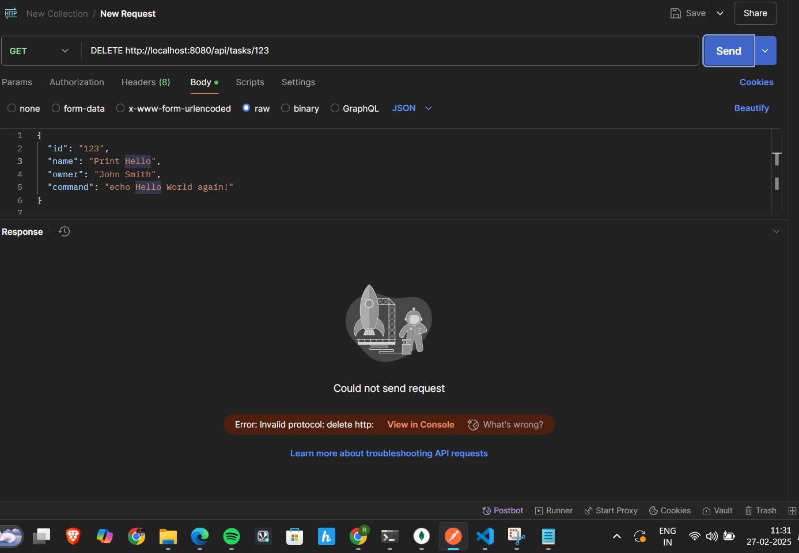

# Task Management API

This README provides a step-by-step guide on how to create a Java REST API with endpoints for searching, creating, updating, and deleting "task" objects. This project demonstrates the use of Spring Boot and MongoDB to build a RESTful API.

## Table of Contents

- [Prerequisites](#prerequisites)
- [Project Setup](#project-setup)
- [Database Configuration](#database-configuration)
- [Project Structure](#project-structure)
- [Implementation Details](#implementation-details)
  - [Create a Task (POST Request)](#create-a-task-post-request)
  - [Get All Tasks (GET Request)](#get-all-tasks-get-request)
  - [Get Task by ID (GET Request)](#get-task-by-id-get-request)
  - [Update Task by ID (PUT Request)](#update-task-by-id-put-request)
  - [Delete Task by ID (DELETE Request)](#delete-task-by-id-delete-request)
  - [Find Tasks by Name (GET Request)](#find-tasks-by-name-get-request)
  - [Execute Task (PUT Request)](#execute-task-put-request)
- [Testing with Postman](#testing-with-postman)
  - [Create Task Request](#create-task-request)
  - [Get All Tasks Request](#get-all-tasks-request)
  - [Get Task by ID Request](#get-task-by-id-request)
  - [Update Task by ID Request](#update-task-by-id-request)
  - [Delete Task by ID Request](#delete-task-by-id-request)
  - [Find Tasks by Name Request](#find-tasks-by-name-request)
  - [Execute Task Request](#execute-task-request)

## Prerequisites

- Java Development Kit (JDK)
- Maven
- Spring Boot
- MongoDB
- Postman (for testing)

## Project Setup

Clone this repository to your local machine:

```sh
git clone https://github.com/your-username/your-repository.git
```

Open the project in your preferred IDE.

Ensure that you have MongoDB installed and running locally.

## Database Configuration

In the `application.properties` file, configure your MongoDB database settings:

```properties
spring.data.mongodb.uri=mongodb://localhost:27017/taskdb
server.port=8080
```

## Project Structure

### Directory Structure

- `src/`: Contains the source code and resources for the project.
  - `main/`: The main application code.
    - `java/`: Java source files.
    - `resources/`: Configuration files like `application.properties`.
  - `test/`: Test code for the application.
- `target/`: Stores compiled bytecode and built artifacts.
- `.gitignore`: Specifies files and directories to be excluded from version control.
- `pom.xml`: Maven configuration file.
- `README.md`: Documentation file.

### Package Structure

- `com.example.serverapi.controller`: Contains REST controller classes handling HTTP requests and responses.
- `com.example.serverapi.model`: Defines data model classes representing entities.
- `com.example.serverapi.repository`: Provides data access and persistence logic using MongoDB.

## Implementation Details

### Create a Task (POST Request)

**Endpoint:**

```http
POST /api/tasks
```

**Request Body:**

```json
{
  "name": "Print Hello",
  "owner": "John Smith",
  "command": "echo Hello World again!"
}
```

### Get All Tasks (GET Request)

**Endpoint:**

```http
GET /api/tasks
```

### Get Task by ID (GET Request)

**Endpoint:**

```http
GET /api/tasks/{id}
```

### Update Task by ID (PUT Request)

**Endpoint:**

```http
PUT /api/tasks/{id}
```

**Request Body:**

```json
{
  "name": "Updated Task",
  "owner": "Jane Doe",
  "command": "echo Updated Command!"
}
```

### Delete Task by ID (DELETE Request)

**Endpoint:**

```http
DELETE /api/tasks/{id}
```

### Find Tasks by Name (GET Request)

**Endpoint:**

```http
GET /api/tasks/findByName?name={task_name}
```

### Execute Task (PUT Request)

**Endpoint:**

```http
PUT /api/tasks/{id}/execute
```

**Response Example:**

```json
{
  "id": "123",
  "name": "Print Hello",
  "owner": "John Smith",
  "command": "echo Hello World again!",
  "taskExecutions": [
    {
      "startTime": "2025-02-27T05:52:42.276Z",
      "endTime": "2025-02-27T05:52:43.276Z",
      "output": "Hello World again!"
    }
  ]
}
```

## Testing with Postman

### Create Task Request


### Get All Tasks Request


### Get Task by ID Request


### Update Task by ID Request


### Delete Task by ID Request



### Find Tasks by Name Request


### Execute Task Request


---

This project demonstrates a fully functional CRUD API using Spring Boot and MongoDB. Feel free to extend it further to suit your requirements. 🚀


